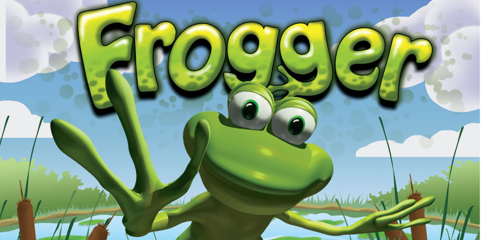
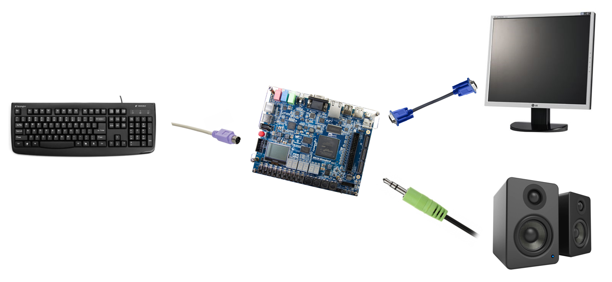
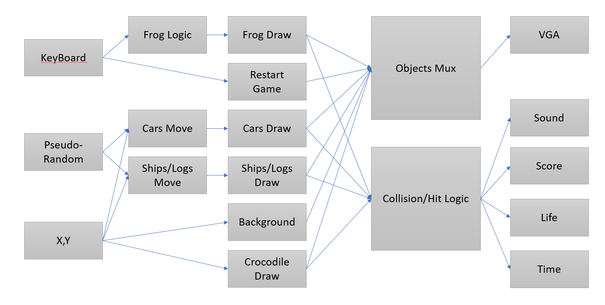
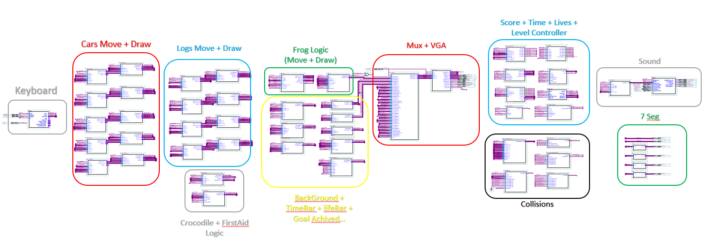
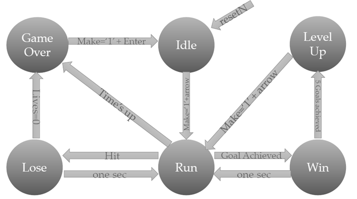
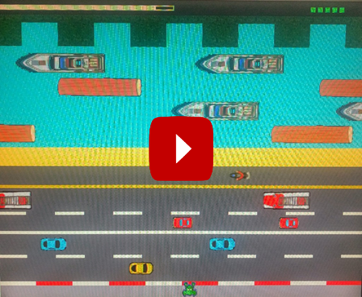

# Frogger-Game
Frogger Game - VHDL 
Sep, 2018

In this project I developed a Frogger game in VHDL.  

**Architecture and Interface**

**Block Diagram**

**High Hierarchy**

**State Machine**

**GamePlay Video**  

